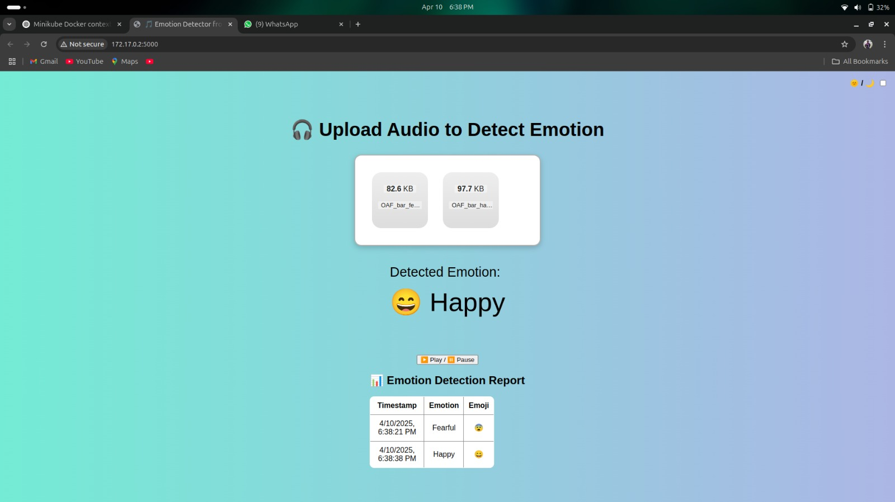

Here's a README template for your Emotion Detection App, which you can use for your GitHub repository:

markdown
Copy
Edit
# Emotion Detection App


This Emotion Detection App leverages machine learning models to classify emotions based on audio inputs. It processes audio files and identifies emotions in the speech, making it useful for applications such as voice-based analytics, mental health applications, or emotion-driven user interaction systems.

## Features
- **Emotion Recognition**: Detect emotions from audio files.
- **Audio Upload**: Upload audio files directly for emotion analysis.
- **Live Prediction**: Get real-time emotion prediction from live audio input.
- **Results Download**: Download the results in a readable format after processing.
- **Dark Mode Toggle**: Switch between dark and light mode for user interface preferences.

## Technologies Used
- **Python**: Main programming language.
- **Flask**: Web framework for building the app.
- **TensorFlow/Keras**: For the emotion detection model (trained using deep neural networks).
- **HTML/CSS/JavaScript**: Frontend for user interaction.
- **Docker**: Containerize the application for easy deployment.
- **GitHub Actions**: (Optional) For Continuous Integration/Continuous Deployment (CI/CD).

## Installation

To run this project locally, follow these steps:

### 1. Clone the repository:
```bash
git clone https://github.com/yourusername/emotion-detection-app.git
cd emotion-detection-app
2. Set up a virtual environment:
bash
Copy
Edit
python3 -m venv venv
source venv/bin/activate  # On Windows, use `venv\Scripts\activate`
3. Install the required dependencies:
bash
Copy
Edit
pip install -r requirements.txt
4. Run the Flask App:
bash
Copy
Edit
python app.py
The app will run locally on http://127.0.0.1:5000/.

Deployment
Docker Setup
Build the Docker image:

bash
Copy
Edit
docker build -t emotion-app .
Run the container:

bash
Copy
Edit
docker run -p 5000:5000 emotion-app
Kubernetes (Optional)
For production-ready deployment, you can use Kubernetes with the provided emotion-app-deployment.yaml and emotion-app-service.yaml.

Contributing
If you'd like to contribute, feel free to fork the repository, make changes, and submit a pull request. Please ensure that your changes are well-documented and include relevant tests if applicable.

License
This project is licensed under the MIT License - see the LICENSE file for details.

Acknowledgements
TensorFlow/Keras: For building the emotion detection model.

Flask: For web framework used in this application.

Docker: For easy containerization and deployment.

OpenCV: (if using for additional features) for handling audio/visual processing.

sql
Copy
Edit

### How to Customize:
- **Replace `yourusername`** in the clone URL with your actual GitHub username.
- **Update the acknowledgments** if there are other libraries or technologies you want to credit.
- **Add links to demo videos** or any other references you have.

Feel free to adjust this README based on any additional features you may have or want to highlight in the app!


